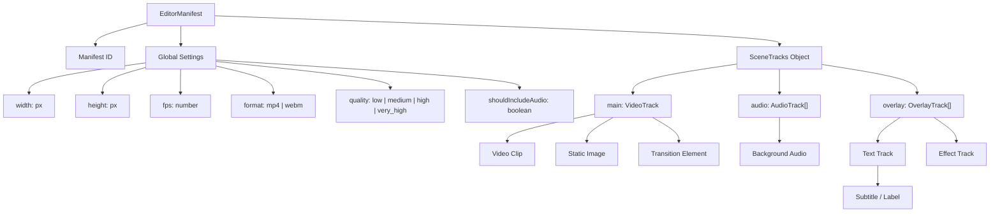

# EditorManifest Architecture Specification

This document details the architectural design and structural schema of the `EditorManifest`, which represents the isomorphic timeline configuration format sent from the client-side editor interface to the `media-render` server-side engine.

---

## 🗺️ 1. Hierarchical Overview

The manifest follows a strict hierarchical tree structure where a timeline is composed of settings, sequential track layers, and time-bounded visual/audio elements.



---

## 📄 2. Core Schema Elements

### A. Global Settings
Defines the canvas constraints, output container format, and encoding profiles:
- **`width` / `height`**: The absolute output resolution (e.g., `1920x1080` for landscape, `1080x1920` for vertical shorts).
- **`fps`**: Target framerate determining the timestep calculation ($t = 1/fps$).
- **`format`**: Target container, yielding either MP4 (H.264/AAC) or WebM (VP9/Opus).
- **`quality`**: Preset resolving to the respective encoding bitrate limits.
- **`shouldIncludeAudio`**: Boolean to determine if the final render should invoke audio mixing and muxing pipelines.

### B. Track Layers
Tracks function as layered timelines under the `tracks` object:
1. **`main`**: The primary `VideoTrack` that serves as the canvas's baseline. It contains visual elements (`VideoElement`, `ImageElement`) and transition elements (`TransitionElement`) placed between consecutive clips.
2. **`audio`**: An array of `AudioTrack` instances for sound overlays (e.g. background music, voiceovers).
3. **`overlay`**: An array of `OverlayTrack` instances (containing `TextTrack`, `GraphicTrack`, or `EffectTrack`) that overlay on top of the main video track.

### C. Elements Timeline Bounds
Every element inherits from `BaseTimelineElement`, enforcing uniform time bounds:
- **`startTime`**: The offset (seconds) from the beginning of the timeline where the element becomes active.
- **`duration`**: The length of time (seconds) the element remains active.
- **`trimStart` / `trimEnd`**: Trimming offsets (seconds) applied relative to the element's original source file.

---

## 🎨 3. Element Specifications

Element parameters are stored inside the `params` block, aligning with the official rendering engine schema:

### `VideoElement` & `ImageElement`
Visual clips with coordinate transforms and blending parameters:
```typescript
interface VideoElement extends BaseTimelineElement {
  type: "video";
  sourceUrl: string; // HTTP asset URL or local path
  params: {
    volume: number;              // Audio gain (0.0 to 1.0, for VideoElement)
    width?: number;              // Custom render width
    height?: number;             // Custom render height
    "transform.positionX"?: number; // Translate X offset (center-based)
    "transform.positionY"?: number; // Translate Y offset (center-based)
    "transform.scaleX"?: number;    // Scale factor X
    "transform.scaleY"?: number;    // Scale factor Y
    "transform.rotate"?: number;    // Rotation degrees
    "transform.opacity"?: number;   // Blending alpha value (0.0 to 1.0)
    blurIntensity?: number;         // Blur filter strength
    [key: string]: any;
  };
}
```

### `TransitionElement`
A standalone transition sitting on the `VideoTrack` at the boundary between two consecutive clips:
```typescript
interface TransitionElement extends BaseTimelineElement {
  type: "transition";
  transitionType: string;   // Registry key of effect (e.g., "fade", "slide_left")
  fromElementId: string;    // ID of the outgoing clip
  toElementId: string;      // ID of the incoming clip
  params?: TransitionParams; // Custom parameters specific to the transition
}

interface TransitionParams {
  intensity?: number;       // Effect strength (e.g., fade opacity, blur scale)
  scale?: number;           // Zoom scaling factor
  angle?: number;           // Spin/rotation degrees
  frequency?: number;       // Waves/oscillation speed
  color?: string;           // Hex tint (e.g., dip-to-color transitions)
  [key: string]: any;
}
```

### `AudioElement`
Auditory elements with gain controls:
```typescript
interface AudioElement extends BaseTimelineElement {
  type: "audio";
  sourceUrl: string;
  params: {
    volume: number;
    fadeIn?: number;   // Fade-in duration (seconds)
    fadeOut?: number;  // Fade-out duration (seconds)
  };
}
```

### `TextElement`
Advanced typography and subtitles:
```typescript
interface TextElement extends BaseTimelineElement {
  type: "text";
  params: {
    content: string;            // Text string
    color: string;              // Text fill color (hex/rgba)
    backgroundColor?: string;   // Text background color
    fontFamily: string;         // Font family name
    fontUrl?: string;           // Remote font URL
    "transform.positionX"?: number;
    "transform.positionY"?: number;
    "transform.rotate"?: number;
    "transform.opacity"?: number;
    strokeColor?: string;       // Outline border color
    strokeWidth?: number;       // Outline thickness
  };
}
```

---

## 🔄 4. Composition Lifecycle on the Server

```
                 [ Receive EditorManifest JSON ]
                                │
               [ Phase 1: Pre-fetch & Load Assets ]
               - Download remote media files
               - Register remote fonts via GlobalFonts
                                │
                 [ Phase 2: Exporter Initiation ]
                 - Compute duration from all tracks
                 - Initialize MediaBunny Output Muxer
                                │
                 [ Phase 3: Composition Loop ]
                 For frame t = 0 to duration:
                 - Rebuild visual Scene Graph: Main video track elements + overlays
                 - Resolve active nodes at time t:
                   * Calculate keyframes
                   * Decode/resolve video frames or image sources
                   * If TransitionNode is active, resolve incoming clip & render offscreen blends
                 - Synchronize Compositor Cache (upload textures)
                 - SkiaCompositor renders all active layers (opacity, blend modes, transforms)
                 - Feed resulting Canvas frame to Output Muxer
                                 │
                  [ Phase 4: Audio Mix & Mux ]
                  - Trim and delay audio sources asynchronously
                  - Mix into a single audio track (amix)
                  - Mux mixed audio with video streams
                                │
                        [ Export MP4/WebM ]
```
