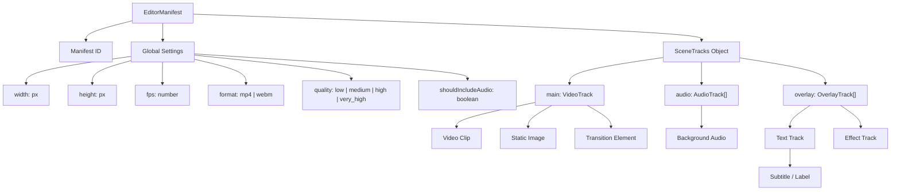

# Đặc tả kiến trúc EditorManifest

Tài liệu này chi tiết hóa thiết kế kiến trúc và cấu trúc dữ liệu JSON của `EditorManifest`, cấu hình dòng thời gian (timeline) đồng nhất được gửi từ trình biên tập client-side đến công cụ kết xuất video (rendering engine) server-side `media-render`.

---

## 🗺️ 1. Sơ đồ phân cấp tổng quan

Manifest tuân theo cấu trúc phân cấp nghiêm ngặt, trong đó dòng thời gian được tạo nên từ cấu hình chung, các lớp track xếp chồng và các phần tử visual/audio bị giới hạn thời gian.



---

## 📄 2. Các thành phần Schema chính

### A. Global Settings (Cấu hình chung)
Định nghĩa kích thước khung hình, định dạng container xuất và cấu hình mã hóa:
- **`width` / `height`**: Độ phân giải xuất ra (ví dụ: `1920x1080` cho video ngang, `1080x1920` cho video dọc/shorts).
- **`fps`**: Số khung hình trên giây xác định tính toán bước thời gian ($t = 1/fps$).
- **`format`**: Định dạng tệp xuất ra, tạo ra MP4 (mã hóa H.264/AAC) hoặc WebM (mã hóa VP9/Opus).
- **`quality`**: Chất lượng mã hóa video.
- **`shouldIncludeAudio`**: Giá trị boolean để xác định có xử lý âm thanh trong quá trình render video hay không.

### B. Track Layers (Các lớp Track)
Các track hoạt động như các dòng thời gian xếp chồng lên nhau trên trục Z-index thông qua đối tượng `tracks`:
1. **`main`**: `VideoTrack` chính làm nền tảng cho canvas. Nó chứa các phần tử hình ảnh chính (`VideoElement`, `ImageElement`) và các hiệu ứng chuyển cảnh (`TransitionElement`) đặt ở ranh giới giữa 2 clip liên tiếp.
2. **`audio`**: Mảng chứa các `AudioTrack` để lồng âm thanh (ví dụ: nhạc nền BGM, giọng nói lồng tiếng).
3. **`overlay`**: Mảng chứa các `OverlayTrack` (gồm `TextTrack`, `GraphicTrack` hoặc `EffectTrack`) để phủ lên trên video chính.

### C. Elements Timeline Bounds (Giới hạn thời gian phần tử)
Mọi phần tử trên dòng thời gian đều kế thừa từ `BaseTimelineElement`, bắt buộc có các thuộc tính:
- **`startTime`**: Thời điểm bắt đầu kích hoạt phần tử (tính bằng giây).
- **`duration`**: Thời lượng phần tử hoạt động trên màn hình (tính bằng giây).
- **`trimStart` / `trimEnd`**: Khoảng thời gian cắt (giây) so với tệp nguồn gốc của tài nguyên.

---

## 🎨 3. Đặc tả chi tiết các Element

Tất cả các tham số tùy chỉnh của element đều được đặt trong khối `params` để đồng bộ với rendering engine:

### `VideoElement` & `ImageElement`
Các clip hiển thị hình ảnh có khả năng transform tọa độ và hiệu ứng mờ:
```typescript
interface VideoElement extends BaseTimelineElement {
  type: "video";
  sourceUrl: string; // Đường dẫn cục bộ hoặc URL từ xa
  params: {
    volume: number;              // Âm lượng nguồn (0.0 đến 1.0, cho VideoElement)
    width?: number;              // Chiều rộng hiển thị tùy chỉnh
    height?: number;             // Chiều cao hiển thị tùy chỉnh
    "transform.positionX"?: number; // Dịch chuyển vị trí X (tính từ tâm)
    "transform.positionY"?: number; // Dịch chuyển vị trí Y (tính từ tâm)
    "transform.scaleX"?: number;    // Hệ số co giãn ngang X
    "transform.scaleY"?: number;    // Hệ số co giãn dọc Y
    "transform.rotate"?: number;    // Góc quay (độ)
    "transform.opacity"?: number;   // Độ mờ đè hình (0.0 đến 1.0)
    blurIntensity?: number;         // Độ mờ viền blurred background
    [key: string]: any;
  };
}
```

### `TransitionElement`
Phần tử chuyển cảnh đứng độc lập trên `VideoTrack` tại biên tiếp xúc giữa 2 clip liên tiếp:
```typescript
interface TransitionElement extends BaseTimelineElement {
  type: "transition";
  transitionType: string;   // Mã định danh hiệu ứng (ví dụ: "fade", "slide_left")
  fromElementId: string;    // ID của clip nguồn phía trước
  toElementId: string;      // ID của clip đích phía sau
  params?: TransitionParams; // Tham số cấu hình riêng của từng hiệu ứng
}

interface TransitionParams {
  intensity?: number;       // Cường độ hiệu ứng (độ mờ, độ nhòe blur...)
  scale?: number;           // Tỉ lệ thu phóng zoom
  angle?: number;           // Góc xoay
  frequency?: number;       // Tần số sóng gợn
  color?: string;           // Mã màu hex lấp màu chuyển cảnh
  [key: string]: any;
}
```

### `AudioElement`
Các tệp âm thanh bổ sung:
```typescript
interface AudioElement extends BaseTimelineElement {
  type: "audio";
  sourceUrl: string;
  params: {
    volume: number;
    fadeIn?: number;   // Thời gian tăng âm lượng lúc đầu (giây)
    fadeOut?: number;  // Thời gian giảm âm lượng lúc cuối (giây)
  };
}
```

### `TextElement`
Phụ đề và nhãn văn bản:
```typescript
interface TextElement extends BaseTimelineElement {
  type: "text";
  params: {
    content: string;            // Nội dung chữ hiển thị
    color: string;              // Màu chữ (hex/rgba)
    backgroundColor?: string;   // Màu nền hộp chữ
    fontFamily: string;         // Tên phông chữ
    fontUrl?: string;           // URL tải phông chữ từ xa (.ttf/.otf)
    "transform.positionX"?: number;
    "transform.positionY"?: number;
    "transform.rotate"?: number;
    "transform.opacity"?: number;
    strokeColor?: string;       // Màu viền chữ
    strokeWidth?: number;       // Độ dày viền chữ
  };
}
```

---

## 🔄 4. Vòng đời kết xuất trên Server (Composition Lifecycle)

```
                 [ Nhận JSON EditorManifest ]
                                │
               [ Phase 1: Tải tài nguyên mẫu ]
               - Tải các tệp video/hình ảnh từ xa về cache
               - Đăng ký phông chữ qua thư viện GlobalFonts
                                │
                 [ Phase 2: Khởi tạo Exporter ]
                 - Tính toán tổng thời lượng xuất video
                 - Khởi tạo luồng ghi MediaBunny Output Muxer
                                │
                 [ Phase 3: Vòng lặp render khung hình ]
                 Với mỗi khung hình t = 0 đến tổng thời lượng:
                 - Dựng lại cấu trúc Scene Graph hiển thị của main track & overlay
                 - Giải quyết (resolve) trạng thái các node tại thời điểm t:
                   * Nội suy giá trị animation/keyframes
                   * Lấy frame video hoặc hình ảnh từ cache
                   * Nếu TransitionNode hoạt động, vẽ đè các clip liên quan lên offscreen canvas
                 - Đồng bộ hóa bộ nhớ đệm Compositor (tải textures lên Skia)
                 - SkiaCompositor vẽ toàn bộ layer (opacity, blend mode, transforms) lên Canvas
                 - Đẩy dữ liệu Canvas khung hình vào bộ mã hóa Output Muxer
                                 │
                  [ Phase 4: Trộn và lồng âm thanh ]
                  - Trích xuất âm thanh gốc, cắt và dịch chuyển thời gian bất đồng bộ
                  - Trộn toàn bộ các nguồn âm thanh thành luồng duy nhất (amix)
                  - Ghép luồng âm thanh trộn vào tệp tin video chính
                                │
                        [ Xuất tệp MP4/WebM ]
```
