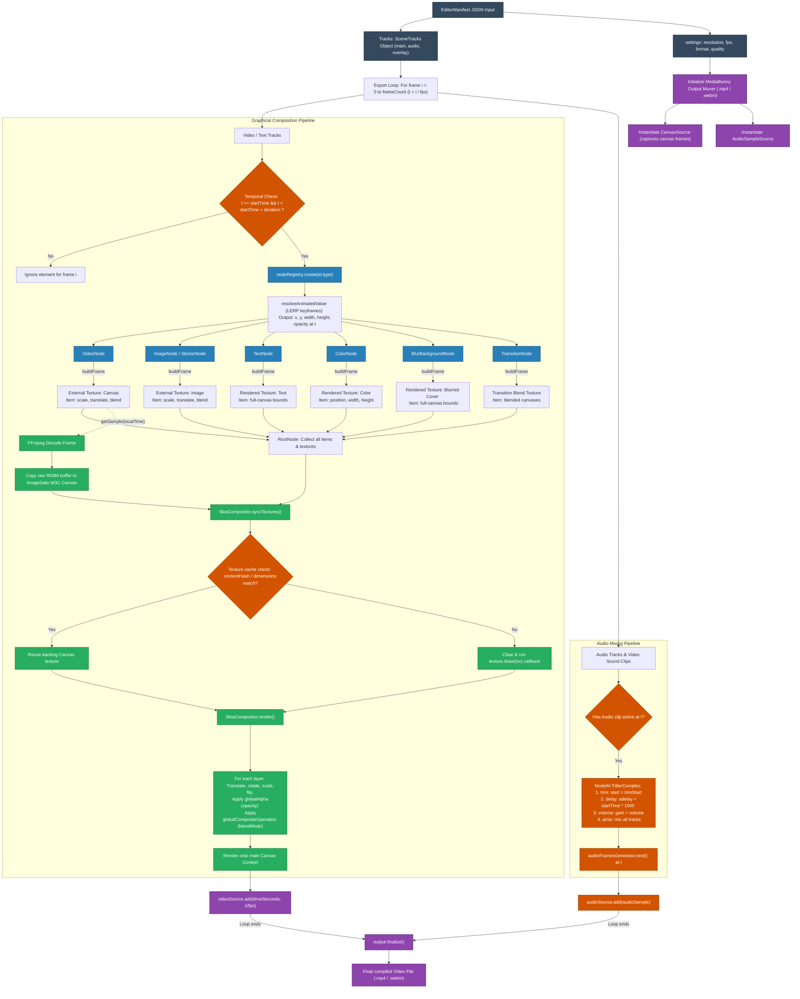

# Chi tiết Luồng xử lý: Từ EditorManifest đến Video đầu ra

Tài liệu này cung cấp mô tả chi tiết về quy trình dựng hình (rendering) và xuất tệp video trong microservice `media-render`. Luồng này giải thích cách cấu hình dòng thời gian JSON (`EditorManifest`) được phân tích, lọc thời gian, dựng hình, trộn âm thanh và đóng gói thành tệp video hoàn chỉnh.

---

## 🎨 1. Sơ đồ luồng dữ liệu End-to-End

Sơ đồ dưới đây biểu diễn toàn bộ vòng đời của quá trình xử lý, bắt đầu từ tệp manifest JSON đầu vào cho đến tệp tin video đầu ra đã được đồng bộ hóa âm thanh và hình ảnh:

---

## 🔍 2. Trình tự thực thi từng bước

### Phase 1: Chuẩn bị & Tải tài nguyên
1. **Yêu cầu API**: Máy chủ chấp nhận cấu hình JSON `EditorManifest` thông qua endpoint `POST /render`.
2. **Khởi tạo môi trường (Bootstrap)**: Tập lệnh [bootstrap.ts](../src/core/renderer/bootstrap.ts) liên kết các đối tượng giả lập `HTMLCanvasElement` và `OffscreenCanvas` vào môi trường chạy server (Bun), và ghi đè (monkey patch) các bộ giải mã phần cứng của NodeAV để tự động chuyển sang chế độ giải mã bằng phần mềm bằng CPU khi thiếu phần cứng GPU tương thích (đặc biệt là khi chạy trong container Docker).
3. **Tải tài nguyên**: [canvas-renderer.ts](../src/core/renderer/canvas-renderer.ts) tải xuống các tài nguyên dạng ảnh, sticker và lưu trữ trong đối tượng bộ nhớ `imagesMap`.
4. **Đăng ký Phông chữ**: Các phông chữ được chỉ định trong manifest sẽ được tải trước và đăng ký động thông qua [font-loader.ts](../src/core/renderer/font-loader.ts) bằng cách gọi hàm `GlobalFonts.registerFromPath`.

---

### Phase 2: Khởi tạo đóng gói Muxing & trộn Audio
1. **Khởi tạo Output**: `exporter.ts` tạo bộ muxer đầu ra trỏ tới một đường dẫn tệp tạm thời trong thư mục `./test-outputs/`.
2. **Canvas Source**: Đăng ký một `CanvasSource` kết nối trực tiếp với canvas dựng hình chính, thiết lập tốc độ khung hình (fps) và mã hóa chất lượng video.
3. **Audio Mixer Graph**: Quét toàn bộ dòng thời gian thu thập các phân đoạn âm thanh (từ cả track nhạc nền và track âm thanh của video clip phụ họa) để xây dựng đồ thị FFmpeg `FilterComplex` thông qua NodeAV:
   - **Trim filter**: `atrim=start={trimStart}` cắt bớt đoạn âm thanh đầu nguồn.
   - **Delay filter**: `adelay={startTime * 1000}|{startTime * 1000}` căn chỉnh thời điểm bắt đầu phát trên dòng thời gian.
   - **Volume filter**: `volume={volume}` điều chỉnh âm lượng (gain).
   - **Amix filter**: `amix=inputs={count}:duration=shortest:normalize=0` hòa trộn tất cả các nguồn âm thanh thành một luồng âm thanh duy nhất.
4. **Muxer Start**: Gọi `output.start()` để ghi phần header của tệp tin và chuẩn bị nhận các gói tin mã hóa.

---

### Phase 3: Vòng lặp kết xuất khung hình (Export Loop)
Với mỗi chỉ số khung hình `i` chạy từ `0` đến tổng số khung hình (độ dài video * FPS), tại mốc thời gian `t = i / fps`:

#### 1. Kiểm tra thời gian & Lọc phần tử hoạt động
- Bộ kết xuất duyệt qua tất cả phần tử của mọi track.
- Một phần tử được chọn để dựng hình **khi và chỉ khi** mốc thời gian hiện tại `t` nằm trong khoảng thời gian hoạt động của nó trên timeline:
  $$\text{startTime} \le t < \text{startTime} + \text{duration}$$

#### 2. Dựng Scene Graph (Cây Node)
- Các phần tử được chọn sẽ được chuyển qua `nodeRegistry.create(el.type, el, this)`.
- Các đối tượng Node tương ứng (như `VideoNode`, `ImageNode`, `TextNode`, `TransitionNode`...) được khởi tạo động và thêm làm con của `RootNode`.

#### 3. Nội suy hiệu ứng chuyển động Keyframe (LERP)
- Nếu các thuộc tính như tọa độ `positionX`, `positionY`, kích thước `width`, `height` hoặc độ mờ `opacity` chứa cấu hình hoạt ảnh keyframe, bộ kết xuất sẽ giải quyết (resolve) giá trị của chúng tại thời điểm clip cục bộ $t_{\text{local}} = t - \text{startTime}$.
- Giá trị $V$ được tính bằng nội suy tuyến tính (Linear Interpolation - LERP) giữa hai mốc keyframe gần nhất $K_1(T_1, V_1)$ và $K_2(T_2, V_2)$:
  $$V = V_1 + \frac{t_{\text{local}} - T_1}{T_2 - T_1} \times (V_2 - V_1)$$

#### 4. Giải quyết tài nguyên bất đồng bộ (Async Resolution)
- Với `VideoNode`, tiến trình sẽ gọi giải mã bất đồng bộ từ luồng NodeAV (`getSample(localTime)`) để lấy đúng frame hình ảnh tại giây hiện tại, sau đó sao chép dữ liệu đệm RGBA thô vào đối tượng `ImageData` của Skia canvas.
- Với `TransitionNode` (khi có chuyển cảnh hoạt động):
  - Tìm hai clip liền kề là `fromNode` (outgoing) và `toNode` (incoming).
  - Ép buộc giải mã frame của `toNode` tại thời điểm tương ứng của nó trong biên chuyển cảnh.
  - Vẽ cả 2 clip ra offscreen canvas độc lập, sau đó gọi render hiệu ứng chuyển cảnh (ví dụ `fade` hay `slide`) để blend dữ liệu hình ảnh trước khi vẽ lên canvas chính.

#### 5. Vẽ tổng hợp khung hình (Skia Compositing)
- Gọi `SkiaCompositor.syncTextures()` để đồng bộ hóa và tải lên các texture hình ảnh/văn bản. Nếu nội dung hoặc kích thước thay đổi, canvas đệm tương ứng sẽ bị xóa và chạy lại callback để vẽ lại texture.
- Gọi `SkiaCompositor.render()` để thực thi vẽ đè toàn bộ các layer hoạt động lên trên canvas chính theo đúng thứ tự xếp lớp Z-index (main track trước, các overlay track sau).
- Khi vẽ, hệ thống áp dụng các phép biến hình transform (dịch chuyển vị trí, xoay góc, co giãn, lật hình) và hòa trộn kênh Alpha (`globalAlpha`) hoặc chế độ trộn màu (`globalCompositeOperation`).

---

### Phase 4: Ghi tệp tin & Hoàn tất đóng gói
1. **Ghi khung hình Video**: Dữ liệu canvas sau khi vẽ xong ở Phase 3 sẽ được chuyển thành frame ảnh thô và đẩy vào `videoSource.add(timeSeconds, 1/fps)`.
2. **Ghi luồng Âm thanh**: Luồng mẫu âm thanh được lấy từ đồ thị trộn FFmpeg và đẩy song song vào `audioSource.add(audioSample)`.
3. **Đóng tệp tin**: Khi vòng lặp chạy hết tổng thời lượng, tiến trình gọi `output.finalize()`. Bộ đóng gói sẽ hoàn tất việc ghép (multiplex) luồng âm thanh và hình ảnh, đồng bộ timestamp, ghi thông tin mục lục và xuất ra tệp video hoàn chỉnh (`.mp4` hoặc `.webm`).
