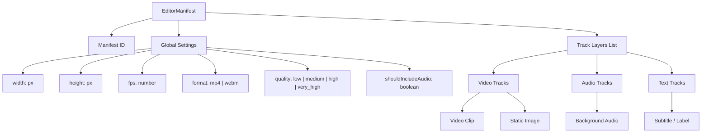

# EditorManifest Architecture Specification

This document details the architectural design and structural schema of the `EditorManifest` (formerly `ProjectManifest`), which represents the isomorphic timeline configuration format sent from the client-side editor interface to the `media-render` server-side engine.

---

## 🗺️ 1. Hierarchical Overview

The manifest follows a strict hierarchical tree structure where a timeline is composed of settings, sequential track layers, and time-bounded visual/audio elements.



---

## 📄 2. Core Schema Elements

### A. Global Settings
Defines the canvas constraints, output container format, and encoding profiles:
- **`width` / `height`**: The absolute output resolution (e.g., `1920x1080` for landscape, `1080x1920` for vertical shorts).
- **`fps`**: Target framerate determining the timestep calculation ($t = 1/fps$).
- **`format`**: Target container, yielding either MP4 (H.264/AAC) or WebM (VP9/Opus).
- **`quality`**: Preset resolving to the respective encoding bitrate limits.
- **`shouldIncludeAudio`**: Boolean to determine if the final render should invoke audio mixing and muxing pipelines.

### B. Track Layers
Tracks function as layered timelines. They coordinate rendering order along the Z-index axis:
1. **VideoTrack**: Holds visual elements (`VideoElement` and `ImageElement`). The track configured with `isMain: true` serves as the canvas's baseline.
2. **AudioTrack**: Houses `AudioElement` instances for sound overlays (e.g. background music, voiceovers).
3. **TextTrack**: Holds `TextElement` layers used for captions, dynamic text overlays, or karaoke subtitles.

### C. Elements Timeline Bounds
Every element inherits from `BaseTimelineElement`, enforcing uniform time bounds:
- **`startTime`**: The offset (seconds) from the beginning of the timeline where the element becomes active.
- **`duration`**: The length of time (seconds) the element remains visible or audible.
- **`trimStart` / `trimEnd`**: Trimming offsets (seconds) applied relative to the element's original source file.

---

## 🎨 3. Element Specifications

### `VideoElement` & `ImageElement`
Visual bounds, coordinates, and blending parameters:
```typescript
interface VideoElement {
  sourceUrl: string; // HTTP asset URL or local path
  width: number;     // Render width
  height: number;    // Render height
  x: number;         // Canvas X-offset
  y: number;         // Canvas Y-offset
  opacity: number;   // Blending alpha value (0.0 to 1.0)
  volume: number;    // Internal audio gain multiplier (for VideoElement)
}
```

### `AudioElement`
Auditory gain and fading controls:
```typescript
interface AudioElement {
  sourceUrl: string;
  volume: number;
  fadeIn?: number;   // Optional fade-in duration (seconds)
  fadeOut?: number;  // Optional fade-out duration (seconds)
}
```

### `TextElement`
Advanced typography and subtitles:
```typescript
interface TextElement {
  text: string;
  style: {
    fontSize: number;
    color: string;      // Fill color (CSS hex/rgb/named)
    fontFamily: string;
    x?: number;         // Center-aligned offset X
    y?: number;         // Offset Y from canvas top
    textAlign?: "left" | "right" | "center" | "start" | "end";
    strokeColor?: string; // Border stroke color for high contrast
    strokeWidth?: number; // Border thickness
    fontUrl?: string;     // URL to fetch remote fonts dynamically
  };
  opacity?: number;
}
```

---

## 🔄 4. Composition Lifecycle on the Server

```
                 [ Receive EditorManifest JSON ]
                               │
               [ Phase 1: Pre-fetch & Load Assets ]
               - Download remote media files
               - Register remote fonts via GlobalFonts
                               │
                [ Phase 2: Exporter Initiation ]
                - Compute duration from main video track
                - Initialize MediaBunny Output Muxer
                               │
                [ Phase 3: Composition Loop ]
                For frame t = 0 to duration:
                - Clear Canvas (Black Background)
                - Filter tracks active at t
                - Draw active Video frames (W3C standard ImageData)
                - Draw static Images and Stickers
                - Render Text overlays (aligned, styled, stroked)
                - Feed resulting Canvas frame to Output Muxer
                               │
                 [ Phase 4: Audio Mix & Mux ]
                 - Trim and delay audio sources asynchronously
                 - Mix into a single audio track (amix)
                 - Mux mixed audio with video streams
                               │
                       [ Export MP4/WebM ]
```
