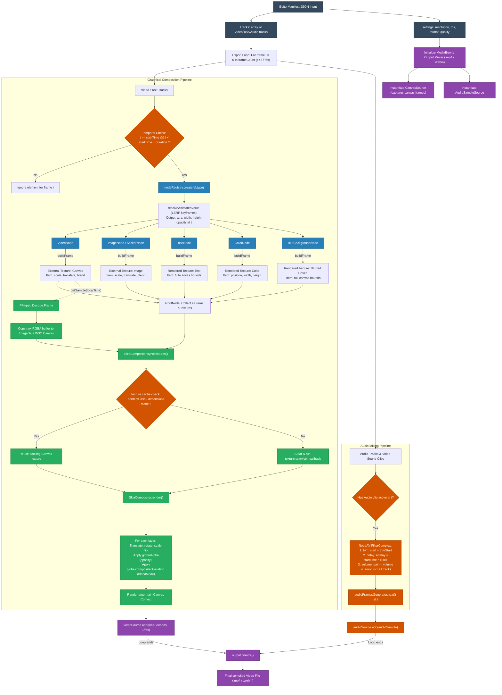

# Detailed Execution Specification: EditorManifest to Video Output

This document provides a comprehensive breakdown of the video rendering and export workflow in `media-render`. It outlines how the JSON timeline configuration (`EditorManifest`) is parsed, filtered, resolved, composited, mixed, and packed into the final video file.

---

## 🎨 1. End-to-End Rendering Dataflow

The diagram below details the entire execution pipeline, beginning with the input JSON manifest down to the multiplexed audio-video file output:

---

## 🔍 2. Step-by-Step Execution Sequence

### Phase 1: Request Bootstrapping & Loading Assets
1. **API Trigger**: The server accepts the `EditorManifest` JSON payload via `POST /render` (defined in [index.ts](../src/index.ts)).
2. **Polyfills & Patches**: The [bootstrap.ts](../src/core/renderer/bootstrap.ts) script binds `HTMLCanvasElement` and `OffscreenCanvas` to the server context, and overrides NodeAV's hardware decoders to guarantee C++ CPU software fallbacks if GPU acceleration is missing (especially inside Docker).
3. **Download Assets**: [canvas-renderer.ts](../src/core/renderer/canvas-renderer.ts) downloads remote images/stickers and caches them in the `imagesMap` object.
4. **Font Registration**: Text fonts specified in the manifest are pre-fetched and registered dynamically via [font-loader.ts](../src/core/renderer/font-loader.ts) using `GlobalFonts.registerFromPath`.

---

### Phase 2: Muxing & Mixing Initialization
1. **Output Creation**: `exporter.ts` initializes the `Output` multiplexer pointing to a temporary file path (`/test-outputs/output-XXX.mp4`).
2. **Canvas Source**: Registers a `CanvasSource` pointing to the main rendering canvas, setting codec quality and framerate.
3. **Audio Mixer Graph**: Collects audio layers (music overlays, video sound tracks) and configures NodeAV's `FilterComplex` graph:
   - **Trim filter**: `atrim=start={trimStart}` crops original source audio.
   - **Delay filter**: `adelay={startTime * 1000}|{startTime * 1000}` aligns starting timestamps on the timeline.
   - **Volume filter**: `volume={volume}` sets the audio gain factor.
   - **Amix filter**: `amix=inputs={count}:duration=shortest:normalize=0` blends all tracks into a single stream.
4. **Muxer Start**: Triggers `output.start()` to write headers and prepare encoding packets.

---

### Phase 3: Fast-Forward Loop & Scene Graph Compilation
For each step index `i` from `0` to total frame count (duration * FPS), at timestamp `t = i / fps`:

#### 1. Temporal Check & Filtering
- The renderer iterates over all elements across manifest tracks.
- An element is selected for rendering **if and only if** the current timestamp `t` lies within its timeline bounds:
  $$\text{startTime} \le t < \text{startTime} + \text{duration}$$

#### 2. Scene Graph Construction
- Selected elements are sent to `nodeRegistry.create(el.type, el, this)`.
- The matching node classes (e.g. `VideoNode`, `ImageNode`, `TextNode`, etc.) are dynamically instantiated and added as children of the `RootNode`.

#### 3. Keyframe Animation Interpolation (LERP)
- If properties like `x`, `y`, `width`, `height`, or `opacity` contain keyframe animation configurations, the renderer resolves their value at local clip time $t_{\text{local}} = t - \text{startTime}$.
- The value $V$ is computed using Linear Interpolation (LERP) between the closest keyframes $K_1(T_1, V_1)$ and $K_2(T_2, V_2)$:
  $$V = V_1 + \frac{t_{\text{local}} - T_1}{T_2 - T_1} \times (V_2 - V_1)$$

#### 4. Descriptor Packing (`buildFrame`)
- Each node constructs its declarative frame representation:
  - **`FrameDescriptor`**: Holds order, coordinates, scale, flip flags, opacity, and blend modes of the layers.
  - **`TextureUploadDescriptor`**: Reference coordinates of external textures (decoded video canvases, preloaded images) or rendered textures (text drawing callbacks, colors).

---

### Phase 4: Skia Compositor Drawing
1. **Texture Synchronization (`syncTextures`)**:
   - `SkiaCompositor` compares the `contentHash` of rendered textures. If unchanged, it skips redrawing. If changed (or for new textures), it clears the backing canvas, runs the node's `draw(ctx)` callback, and caches it.
   - **Video Frame Decoding**: For `VideoNode`, `VideoSampleSink.getSample(localTime)` retrieves the raw decoded packet from FFmpeg. It allocates a buffer, copies raw RGBA pixels into a W3C standard `ImageData` object, draws it on a temporary canvas, and immediately calls `sample.close()` to prevent memory leaks.
2. **Layers Composition (`render`)**:
   - Clears the main canvas context with the background color.
   - Iterates through the list of layers.
   - Sets the global opacity (`globalAlpha = opacity`) and blend mode (`globalCompositeOperation = blendMode`).
   - If the layer requires transformations (rotation, flips, scales), it applies matrix transformations to the context.
   - Draws the texture using `ctx.drawImage()`.

---

### Phase 5: Frame Muxing & Output Finalization
1. **Frame Capture**: Captures the canvas frame via `videoSource.add(timeSeconds, 1 / fps)`.
2. **Audio Mix Writing**: Pulls the mixed audio sample from the FilterComplex generator at time `t` and writes it to the output audio track (`audioSource.add(sample)`).
3. **Muxer Finalize**: Once the loop finishes, finalizes the output file, flushes streams, writes indexes, and outputs the finished `.mp4`/`.webm` video file.
