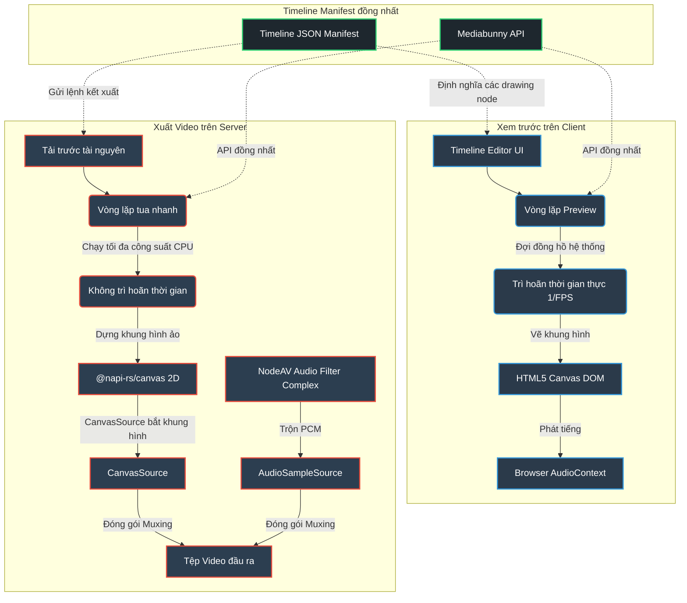
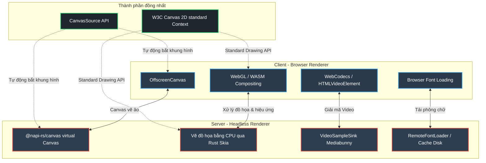

# Đặc tả Thiết kế: Bộ kết xuất dòng thời gian đồng nhất (Isomorphic Timeline Renderer)

Đặc tả thiết kế này chi tiết hóa luồng công việc, sơ đồ kiến trúc và cấu trúc mã nguồn được triển khai để chuyển đổi (port) công cụ kết xuất video/dòng thời gian phi tuyến tính từ phía client (`opencut-classic`) sang phía server (`media-render`).

Mục tiêu chính là **duy trì tương thích 100% về API signature (các Lớp, Hàm, Tham số) với client** để đảm bảo dễ dàng đồng bộ hóa, đồng thời thay thế các thành phần chỉ chạy trên trình duyệt (Canvas DOM, WebGL) bằng các thư viện tương đương chạy trên máy chủ (`@napi-rs/canvas`).

---

## 🎨 1. Kiến trúc Hệ thống Hình ảnh

### A. Sơ đồ So sánh: Xem trước trên Client (Client Preview) vs Kết xuất trên Server (Server Export)
Mã nguồn phía server loại bỏ hoàn toàn việc chờ đợi thời gian thực (real-time tick delays) và giới hạn tương tác DOM để đạt được hiệu suất kết xuất tối đa:

---

### B. Ánh xạ Công nghệ cốt lõi
Bảng ánh xạ chi tiết các thư viện trình duyệt sang các thư viện thay thế chạy trên server:

---

## ⚙️ 2. Quy trình Vẽ chi tiết của Bộ Kết xuất

Cốt lõi của quá trình kết xuất nằm ở vòng lặp tua nhanh thời gian (Fast-Forward Loop) chạy độc lập với đồng hồ hệ thống:

1. **Khởi tạo Canvas ảo**: `media-render` khởi tạo một đối tượng Canvas ảo từ thư viện `@napi-rs/canvas` với kích thước được chỉ định bởi cấu hình `settings` của manifest.
2. **Khởi tạo nguồn hình ảnh (CanvasSource)**: Kết nối canvas ảo này với bộ mã hóa video của `Mediabunny`.
3. **Giải quyết node theo mốc thời gian**:
   - Tại mỗi bước thời gian $t = i / fps$, bộ quản lý duyệt qua cây Scene Graph (các Node như `VideoNode`, `TextNode`, `ImageNode`, `TransitionNode`).
   - Các thuộc tính hoạt ảnh keyframe được nội suy và áp dụng các phép dịch chuyển, co giãn, xoay và opacity xung quanh tọa độ tâm của mỗi node.
4. **Vẽ đè đồ họa**: Skia engine (Rust) biên dịch các lệnh vẽ Canvas 2D chuẩn W3C và lưu ảnh trực tiếp vào bộ đệm của canvas ảo.
5. **Đóng gói Video/Audio**: Bộ giải mã video bắt các khung hình này từ canvas, đồng thời lồng kênh âm thanh đã trộn từ FFmpeg `FilterComplex` để ghi trực tiếp xuống ổ đĩa.
