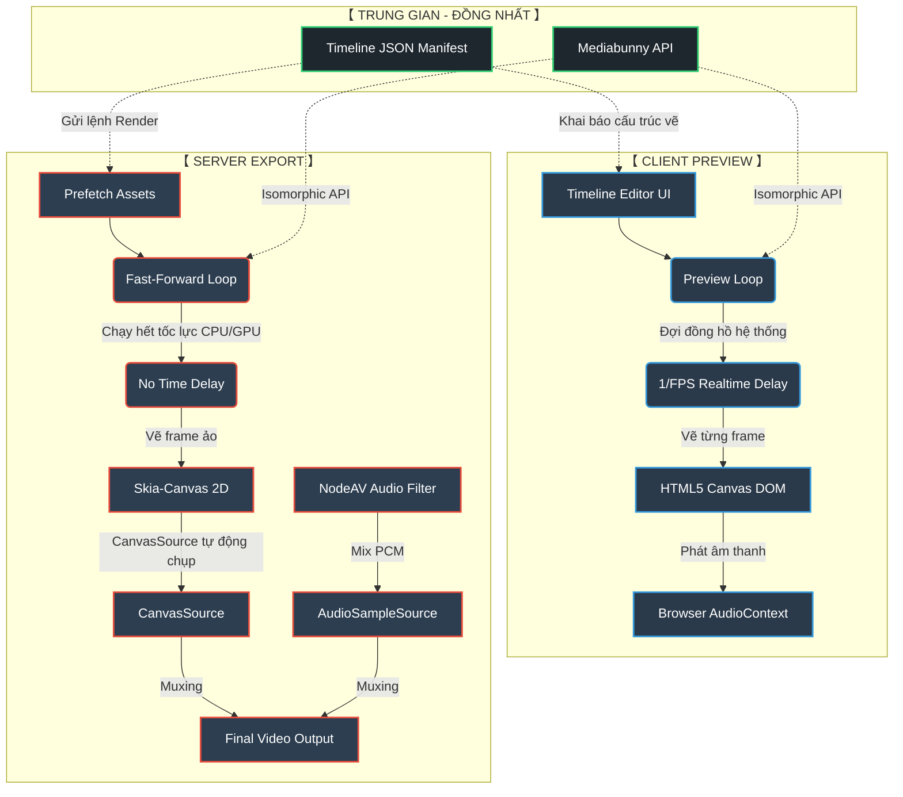
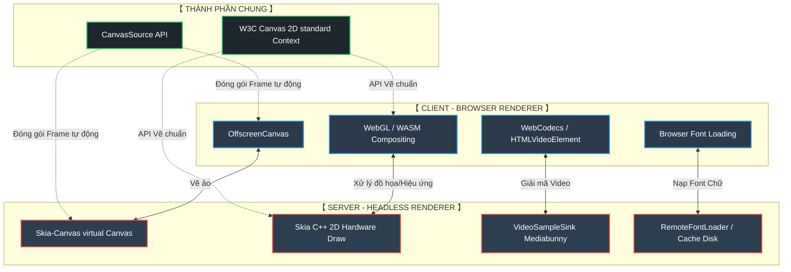
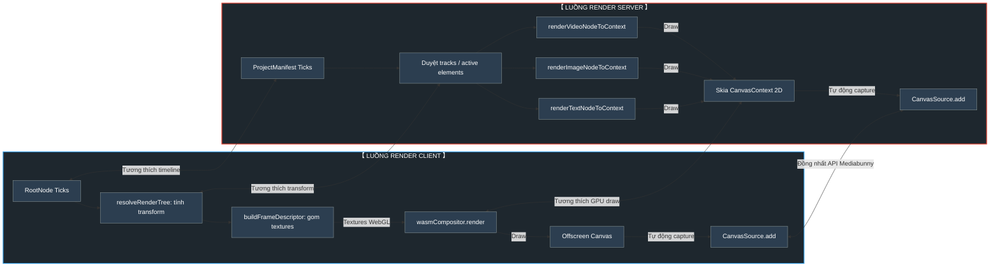
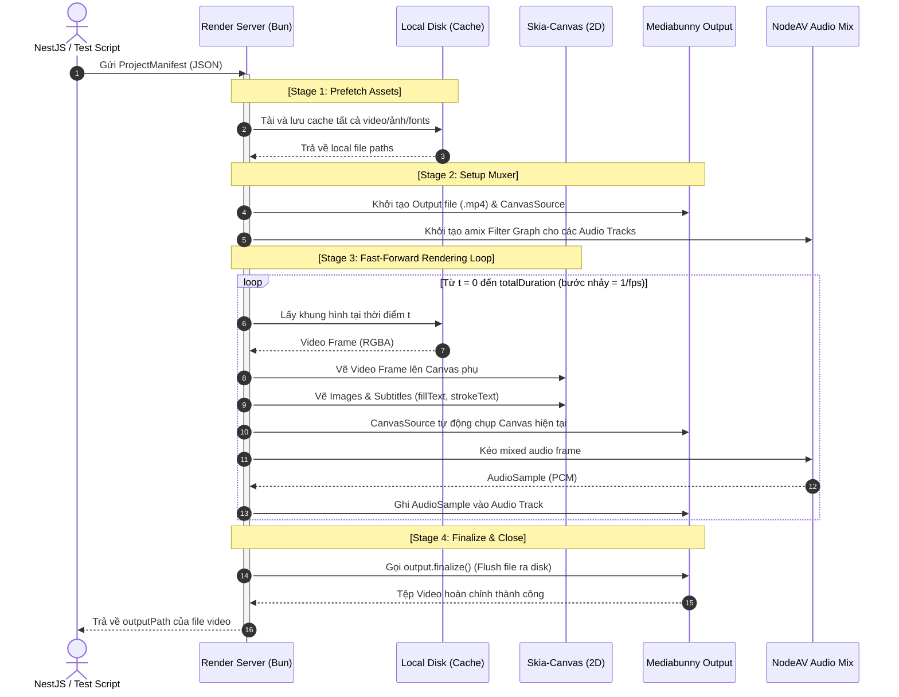

# Kế Hoạch Thiết Kế: Bộ Dựng Hình Video Timeline Đồng Nhất (Isomorphic Timeline Renderer)

Bản thiết kế này mô tả chi tiết quy trình, sơ đồ trực quan và mã nguồn triển khai để di chuyển (migrate) lõi render video timeline từ client (`opencut-classic`) về server (`media-render`).

Mục tiêu cốt lõi là **giữ nguyên 100% chữ ký API (Class, Function, Parameters) giống client** để dễ dàng đối chiếu, đồng bộ, chỉ thay thế định nghĩa (internals) bên dưới cho phù hợp với môi trường Server (dùng `skia-canvas` thay cho browser Canvas/WebGL).

---

## 🎨 1. Sơ Đồ Trực Quan Hệ Thống (Visual Diagrams)

### A. Sơ Đồ So Sánh: Client Preview vs Server Render
Server loại bỏ hoàn toàn các bước trễ thời gian thực và DOM rendering của client để đạt hiệu năng tối đa:



---

### B. Sơ Đồ So Sánh Cấu Trúc Renderer (Client Renderer vs Server Renderer)
Sơ đồ dưới đây thể hiện sự đối chiếu chi tiết 1-1 về mặt công nghệ và cách xử lý vẽ giữa Client và Server:



---

### C. Sơ Đồ Song Song: Đối Chiếu Luồng Vẽ Frame (Side-by-Side Drawing Pipelines)
Sơ đồ dưới đây thể hiện chi tiết sự tương thích 1-1 trong từng khâu giải quyết timeline và dựng hình:



---

### D. Sơ Đồ Tuần Tự (Sequence Diagram)
Mô tả quy trình xử lý timeline phi thời gian thực trên Server:



---

## 🔍 2. Phân Tích So Sánh Chi Tiết Lõi `Renderer` (Client vs Server)

Để đồng bộ 1-1, chúng ta ánh xạ trực tiếp cơ chế hoạt động của `CanvasRenderer` ở cả 2 môi trường:

```
                  ┌──────────────────────────────────────────┐
                  │    PHÂN TÍCH SO SÁNH PHẦN LÕI RENDERER   │
                  └──────────────────────────────────────────┘
                  
         【 CLIENT RENDERER 】                      【 SERVER RENDERER 】
 ┌───────────────────────────────────┐      ┌───────────────────────────────────┐
 │ • HTMLCanvasElement               │      │ • Skia-Canvas Canvas (2D)         │
 │ • WebGL / WebAssembly Compositing │  vs  │ • Skia 2D Hardware Acceleration   │
 │ • HTMLVideoElement / Image Element│      │ • VideoSampleSink (Mediabunny)    │
 │ • measureText / 2D Canvas Text    │      │ • RemoteFontLoader (Tự động tải)  │
 └───────────────────────────────────┘      └───────────────────────────────────┘
```

### A. Đối Chiếu Các Khâu Xử Lý Vẽ Khung Hình

| Khâu Xử Lý | Client Renderer (`canvas-renderer.ts`) | Server Renderer (`canvas-renderer.ts`) |
| :--- | :--- | :--- |
| **Bản vẽ ảo** | Sử dụng `OffscreenCanvas` tích hợp của browser để làm bản vẽ phụ. | Sử dụng `Canvas` của thư viện `skia-canvas` làm bản vẽ ảo trong RAM. |
| **Độ Phân Giải** | Nhận `width`, `height` và thay đổi kích thước bằng thuộc tính `.width`, `.height` của canvas DOM. | Nhận `width`, `height` từ Settings và khởi tạo kích thước cố định bằng `new Canvas(width, height)`. |
| **Quy Trình Vẽ (Render Loop)** | 1. Gọi `resolveRenderTree` tính toán transform tại thời điểm `time`. <br>2. Gọi `buildFrameDescriptor` tạo textures WebGL. <br>3. `wasmCompositor.render` vẽ lên màn hình. | 1. Duyệt qua danh sách `manifest.tracks`. <br>2. Lọc các elements hoạt động tại thời điểm `time`. <br>3. Vẽ tuần tự các node lên context Skia Canvas. |
| **Lấy Khung hình Video** | Dùng thẻ `<video>` hoặc bộ giải mã WebCodecs để lấy texture WebGL của frame. | Dùng `VideoSampleSink.getSample(time)` của Mediabunny để decode frame C++ native. |
| **Vẽ Video lên Canvas** | Gọi `ctx.drawImage(videoElement)` hoặc dùng WebGL texture. | Dùng helper `drawVideoNodeToContext`: Copy pixel RGBA của `VideoSample` sang canvas phụ rồi `ctx.drawImage` lên canvas chính. |
| **Dựng Font Chữ** | Tự động load qua Google Fonts hoặc `@font-face` CSS bằng link remote. | Tự động download link remote font từ manifest và đăng ký bằng `FontLibrary.use()` qua `RemoteFontLoader`. |
| **Hiệu Ứng (Filter/Blend)** | Sử dụng WebGL Fragment Shaders (`wasmCompositor`). | Sử dụng các thuộc tính 2D chuẩn của Skia Canvas: `ctx.filter` (blur, contrast) và `ctx.globalCompositeOperation`. |

---

## 🗺 3. Cấu Trúc Thư Mục Porting (1-1 Folder Structure)

Chúng ta sẽ tái cấu trúc thư mục render trên Server đồng nhất với client:

```
media-render/src/
├── index.ts                      # Khởi chạy server & health checks
├── types/
│   └── opencut.ts                # Định nghĩa manifest, tracks, elements
└── services/
    └── renderer/                 # Thư mục lõi render (Porting từ client)
        ├── scene-exporter.ts     # Class SceneExporter điều phối export
        ├── canvas-renderer.ts    # Class CanvasRenderer vẽ frame
        ├── font-loader.ts        # Helper tải và nạp remote font chữ
        └── nodes/                # Các hàm vẽ từng loại layer
            ├── video-node.ts     # Vẽ khung hình Video
            ├── image-node.ts     # Vẽ Ảnh
            └── text-node.ts      # Vẽ Chữ Subtitles/Lyrics viền stroke
```

---

## 📐 4. Định Nghĩa Chi Tiết API & Class (Isomorphic Signatures)

### A. Tệp `scene-exporter.ts` (Class điều phối)
Lớp điều phối xuất video, giữ nguyên chữ ký API của client, sử dụng `CanvasSource` của Mediabunny kết nối trực tiếp với Skia Canvas.

```typescript
import { Output, Mp4OutputFormat, WebMOutputFormat, FilePathTarget, CanvasSource, AudioSampleSource, AudioSample } from "mediabunny";
import { CanvasRenderer } from "./canvas-renderer";
import { ProjectManifest } from "../../types/opencut";
import * as path from "path";

export type ExportParams = {
  width: number;
  height: number;
  fps: number;
  format: "mp4" | "webm";
  quality: "low" | "medium" | "high" | "very_high";
  shouldIncludeAudio?: boolean;
};

export class SceneExporter {
  private renderer: CanvasRenderer;
  private format: "mp4" | "webm";
  private quality: "low" | "medium" | "high" | "very_high";
  private shouldIncludeAudio: boolean;

  constructor({ width, height, fps, format, quality, shouldIncludeAudio }: ExportParams) {
    this.renderer = new CanvasRenderer({ width, height, fps });
    this.format = format;
    this.quality = quality;
    this.shouldIncludeAudio = shouldIncludeAudio ?? false;
  }

  public async export(manifest: ProjectManifest): Promise<string> {
    const outputDir = path.resolve("./test-outputs");
    const outputPath = path.join(outputDir, `output-${crypto.randomUUID()}.${this.format}`);
    const fpsFloat = manifest.settings.fps;
    const timeStep = 1 / fpsFloat;

    const output = new Output({
      format: this.format === "webm" ? new WebMOutputFormat() : new Mp4OutputFormat(),
      target: new FilePathTarget(outputPath),
    });

    // Gắn trực tiếp skia-canvas vào CanvasSource
    const videoSource = new CanvasSource(this.renderer.canvas as any, {
      codec: this.format === "webm" ? "vp9" : "avc",
      bitrate: 4e6,
      hardwareAcceleration: (process.env.HARDWARE_ACCELERATION as any) || "no-preference",
    });
    output.addVideoTrack(videoSource);

    // Audio & Filter graph (amix) ở background
    let audioSource: AudioSampleSource | null = null;
    let complexFilter: any = null;
    let finalAudioLabel = "";
    const audioClips = this.renderer.collectAudioClips(manifest);

    if (this.shouldIncludeAudio && audioClips.length > 0) {
      audioSource = new AudioSampleSource({
        codec: this.format === "webm" ? "opus" : "aac",
        bitrate: 192e3,
      });
      output.addAudioTrack(audioSource);
      
      const audioSetup = await this.renderer.setupAudioMix(audioClips);
      complexFilter = audioSetup.filter;
      finalAudioLabel = audioSetup.label;
    }

    await output.start();

    // Vòng lặp render tuần tự
    const totalDuration = this.renderer.calculateDuration(manifest);

    for (let t = 0; t < totalDuration; t += timeStep) {
      // Dựng hình lên canvas ảo
      await this.renderer.render({ manifest, time: t });

      // CanvasSource tự động chụp frame hiện tại
      await videoSource.add(t, timeStep);

      // Trộn âm thanh native
      if (audioSource && complexFilter && finalAudioLabel) {
        await this.renderer.pushAudioFrames(audioSource, complexFilter, finalAudioLabel);
      }
    }

    videoSource.close();
    if (complexFilter) complexFilter.close();
    await output.finalize();
    await this.renderer.dispose();

    return outputPath;
  }
}
```

### B. Tệp `canvas-renderer.ts` (Bộ vẽ Canvas)
Lớp quản lý vòng đời Canvas, tải trước assets và remote fonts.

```typescript
import { Canvas, Image } from "skia-canvas";
import { Input, FilePathSource, ALL_FORMATS } from "mediabunny";
import { renderVideoNodeToContext } from "./nodes/video-node";
import { renderImageNodeToContext } from "./nodes/image-node";
import { renderTextNodeToContext } from "./nodes/text-node";
import { ProjectManifest } from "../../types/opencut";
import { RemoteFontLoader } from "./font-loader";
import * as av from "node-av";
import * as path from "path";

export class CanvasRenderer {
  public canvas: Canvas;
  public context: any;
  public width: number;
  public height: number;
  public fps: number;

  private inputsMap: Record<string, Input> = {};
  private videoSinksMap: Record<string, any> = {};
  private imagesMap: Record<string, Image> = {};
  private audioDemuxers: av.Demuxer[] = [];
  private audioDecodersMap: Record<string, av.Decoder> = {};

  constructor({ width, height, fps }: { width: number; height: number; fps: number }) {
    this.width = width;
    this.height = height;
    this.fps = fps;
    this.canvas = new Canvas(width, height);
    this.context = this.canvas.getContext("2d");
  }

  public calculateDuration(manifest: ProjectManifest): number {
    const mainVideoTrack = manifest.tracks.find(t => t.type === "video" && (t as any).isMain);
    if (!mainVideoTrack) return 0;
    return mainVideoTrack.elements.reduce((acc, el) => acc + el.duration, 0);
  }

  public async render({ manifest, time }: { manifest: ProjectManifest; time: number }) {
    const ctx = this.context;
    
    ctx.clearRect(0, 0, this.width, this.height);
    ctx.fillStyle = "black";
    ctx.fillRect(0, 0, this.width, this.height);

    await this.ensureAssetsLoaded(manifest);

    // Dựng các nodes theo thứ tự tracks
    for (const track of manifest.tracks) {
      if (track.type === "video") {
        for (const el of track.elements) {
          if (time >= el.startTime && time < el.startTime + el.duration) {
            if (el.type === "video") {
              await renderVideoNodeToContext({ el: el as any, time, ctx, videoSinksMap: this.videoSinksMap });
            } else if (el.type === "image") {
              renderImageNodeToContext({ el: el as any, ctx, imagesMap: this.imagesMap });
            }
          }
        }
      } else if (track.type === "text") {
        for (const el of track.elements) {
          if (time >= el.startTime && time < el.startTime + el.duration) {
            renderTextNodeToContext({ el: el as any, ctx, canvasWidth: this.width, canvasHeight: this.height });
          }
        }
      }
    }
  }

  public collectAudioClips(manifest: ProjectManifest) {
    const clips: any[] = [];
    for (const track of manifest.tracks) {
      if (track.type === "audio") {
        clips.push(...track.elements);
      } else if (track.type === "video") {
        clips.push(...track.elements.filter(el => el.type === "video"));
      }
    }
    return clips;
  }

  public async setupAudioMix(clips: any[]) {
    const filterParts: string[] = [];
    const audioLabels: string[] = [];
    let audioInputIdx = 0;

    for (const clip of clips) {
      try {
        const demuxer = await av.Demuxer.open(clip.sourceUrl);
        const stream = demuxer.audio();
        if (stream) {
          this.audioDemuxers.push(demuxer);
          const key = `${audioInputIdx}:a`;
          this.audioDecodersMap[key] = await av.Decoder.create(stream);
          
          const delayMs = Math.round(clip.startTime * 1000);
          const label = `a_${clip.id}`;
          const vol = clip.volume !== undefined ? clip.volume : 1.0;

          filterParts.push(`[${audioInputIdx}:a]atrim=start=${clip.trimStart},asetpts=PTS-STARTPTS,adelay=${delayMs}|${delayMs},volume=${vol}[${label}]`);
          audioLabels.push(`[${label}]`);
          audioInputIdx++;
        } else {
          demuxer[Symbol.dispose]();
        }
      } catch (err) {
        console.warn(`[CanvasRenderer] Skip audio for input ${clip.sourceUrl}:`, err);
      }
    }

    let finalAudioLabel = "";
    if (audioLabels.length > 1) {
      filterParts.push(`${audioLabels.join("")}amix=inputs=${audioLabels.length}:duration=shortest:normalize=0[a_final]`);
      finalAudioLabel = "a_final";
    } else if (audioLabels.length === 1) {
      filterParts.push(`${audioLabels[0]}anull[a_final]`);
      finalAudioLabel = "a_final";
    }
    
    const filterComplexString = filterParts.join("; ");
    const filterComplexInputConfigs = Object.keys(this.audioDecodersMap).map(label => ({ label }));
    const filterComplexOutputConfigs = [{ label: finalAudioLabel, mediaType: av.AVMEDIA_TYPE_AUDIO }];
    
    const filter = av.FilterComplexAPI.create(filterComplexString, {
      inputs: filterComplexInputConfigs,
      outputs: filterComplexOutputConfigs,
    });

    return { filter, label: finalAudioLabel };
  }

  public async pushAudioFrames(audioSource: any, complexFilter: any, finalAudioLabel: string) {
    while (true) {
      let audioFrame: av.Frame | null | undefined = null;
      try {
        audioFrame = await complexFilter.receive(finalAudioLabel);
      } catch {
        audioFrame = null;
      }
      if (!audioFrame) break;

      const { AudioSample } = await import("mediabunny");
      const { AvFrameAudioSampleResource } = await import("@mediabunny/server");
      const audioSample = new AudioSample(new AvFrameAudioSampleResource(audioFrame));
      await audioSource.add(audioSample);
      audioSample.close();
    }
  }

  private async ensureAssetsLoaded(manifest: ProjectManifest) {
    for (const track of manifest.tracks) {
      for (const el of track.elements) {
        if ("sourceUrl" in el && el.sourceUrl) {
          const key = el.id;
          if (el.type === "video" && !this.inputsMap[key]) {
            const input = new Input({ source: new FilePathSource(el.sourceUrl), formats: ALL_FORMATS });
            this.inputsMap[key] = input;
            const videoTracks = await input.getVideoTracks();
            const track = videoTracks[0];
            if (track) {
              const { VideoSampleSink } = await import("mediabunny");
              this.videoSinksMap[key] = new VideoSampleSink(track, {
                hardwareAcceleration: (process.env.HARDWARE_ACCELERATION as any) || "no-preference",
              });
            }
          } else if (el.type === "image" && !this.imagesMap[key]) {
            const img = new Image();
            img.src = el.sourceUrl.startsWith("http") ? el.sourceUrl : path.resolve(el.sourceUrl);
            await img.decode();
            this.imagesMap[key] = img;
          }
        }
        
        // Tải remote font nếu được chỉ định link remote trong TextElement style
        if (el.type === "text" && (el.style as any).fontUrl) {
          await RemoteFontLoader.useRemote(el.style.fontFamily, (el.style as any).fontUrl);
        }
      }
    }
  }

  public async dispose() {
    for (const d of this.audioDemuxers) {
      d[Symbol.dispose]();
    }
    for (const key in this.audioDecodersMap) {
      this.audioDecodersMap[key][Symbol.dispose]();
    }
    for (const key in this.inputsMap) {
      await this.inputsMap[key].dispose();
    }
  }
}
```

### C. Tệp `font-loader.ts` (Class tải và đăng ký Remote Font)
```typescript
import { FontLibrary } from "skia-canvas";
import * as fs from "fs";
import * as path from "path";
import * as crypto from "crypto";

export class RemoteFontLoader {
  private static cacheDir = path.resolve("./cache/fonts");

  public static async useRemote(alias: string, url: string): Promise<void> {
    const urlHash = crypto.createHash("md5").update(url).digest("hex");
    const extension = path.extname(new URL(url).pathname) || ".ttf";
    const localPath = path.join(this.cacheDir, `${urlHash}${extension}`);

    if (fs.existsSync(localPath)) {
      FontLibrary.use(alias, localPath);
      return;
    }

    try {
      const response = await fetch(url);
      if (!response.ok) throw new Error(`Failed to fetch font from ${url}`);
      
      const buffer = await response.arrayBuffer();
      
      fs.mkdirSync(this.cacheDir, { recursive: true });
      fs.writeFileSync(localPath, Buffer.from(buffer));

      FontLibrary.use(alias, localPath);
      console.log(`[FontLoader] Tải và nạp thành công remote font [${alias}] từ: ${url}`);
    } catch (err) {
      console.error(`[FontLoader] Lỗi khi nạp remote font [${alias}]:`, err);
    }
  }
}
```
