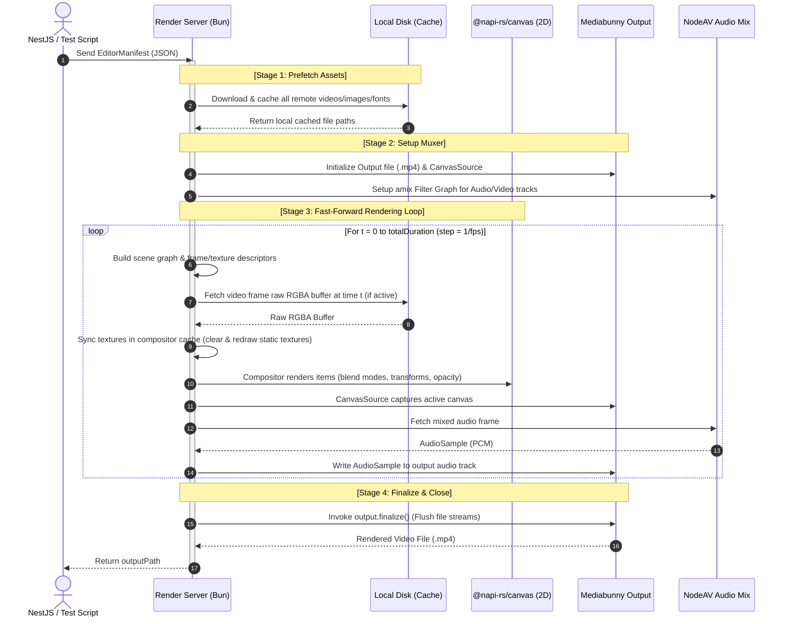

# Design Specification: Isomorphic Timeline Renderer

This design specification details the workflows, architecture diagrams, and code structures implemented to port the non-linear video/timeline rendering engine from the client side (`opencut-classic`) to the server side (`media-render`).

The primary objective is to **maintain 100% API signature parity (Classes, Functions, Parameters) with the client** to ensure ease of alignment and synchronization, while replacing internal browser-only implementations (Canvas, WebGL) with server-native equivalents (`@napi-rs/canvas`).

---

## 🎨 1. Visual System Architecture

### A. Comparison Diagram: Client Preview vs. Server Render
The server-side implementation bypasses all real-time tick delays and DOM interaction bounds to achieve maximum throughput and performance:

```mermaid
graph TB
    classDef clientClass fill:#2b3a4a,stroke:#3498db,stroke-width:2px,color:#fff;
    classDef serverClass fill:#2c3e50,stroke:#e74c3c,stroke-width:2px,color:#fff;
    classDef sharedClass fill:#1e272e,stroke:#2ecc71,stroke-width:2px,color:#fff;

    subgraph Client ["Client Preview"]
        A1["Timeline Editor UI"] --> A2("Preview Loop")
        A2 -->|Waits for system clock| A3("1/FPS Realtime Delay")
        A3 -->|Renders frame| A4["HTML5 Canvas DOM"]
        A4 -->|Plays sound| A5["Browser AudioContext"]
    end

    subgraph Shared ["System Independent Manifest"]
        M1["Timeline JSON Manifest"]
        M2["Mediabunny API"]
    end

    subgraph Server ["Server Export"]
        B1[Prefetch Assets] --> B2(Fast-Forward Loop)
        B2 -->|Runs at maximum CPU/GPU capacity| B3(No Time Delay)
        B3 -->|Renders virtual frame| B4[@napi-rs/canvas 2D]
        B4 -->|CanvasSource captures frame| B5[CanvasSource]
        B6[NodeAV Audio Filter] -->|Mix PCM| B7[AudioSampleSource]
        B5 & B7 -->|Muxing| B8[Final Video Output]
    end

    M1 -.->|Defines drawing nodes| A1
    M1 -.->|Submits Render Command| B1
    M2 -.->|Isomorphic API| A2
    M2 -.->|Isomorphic API| B2

    class A1,A2,A3,A4,A5 clientClass;
    class B1,B2,B3,B4,B5,B6,B7,B8 serverClass;
    class M1,M2 sharedClass;
```

---

### B. Core Technology Mapping
Detailed comparison of the internal dependencies mapping client abstractions to server-safe implementations:

```mermaid
graph TB
    classDef clientClass fill:#2b3a4a,stroke:#3498db,stroke-width:2px,color:#fff;
    classDef serverClass fill:#2c3e50,stroke:#e74c3c,stroke-width:2px,color:#fff;
    classDef sharedClass fill:#1e272e,stroke:#2ecc71,stroke-width:2px,color:#fff;

    subgraph ClientRenderer ["Client - Browser Renderer"]
        C1["OffscreenCanvas"]
        C2["WebGL / WASM Compositing"]
        C3["WebCodecs / HTMLVideoElement"]
        C4["Browser Font Loading"]
    end

    subgraph SharedRenderer ["Isomorphic Shards"]
        S1["W3C Canvas 2D standard Context"]
        S2["CanvasSource API"]
    end

    subgraph ServerRenderer ["Server - Headless Renderer"]
        R1[@napi-rs/canvas virtual Canvas]
        R2[Rust CPU 2D Software Draw]
        R3[VideoSampleSink Mediabunny]
        R4[RemoteFontLoader / Cache Disk]
    end

    %% Mapping
    C1 <-->|Virtual drawing canvas| R1
    C2 <-->|Graphics/Effects processing| R2
    C3 <-->|Video Decoding| R3
    C4 <-->|Font Loading| R4

    %% Unified interfaces
    S1 -.->|Standard Drawing API| C2
    S1 -.->|Standard Drawing API| R2
    S2 -.->|Automatic Frame Capture| C1
    S2 -.->|Automatic Frame Capture| R1

    class C1,C2,C3,C4 clientClass;
    class R1,R2,R3,R4 serverClass;
    class S1,S2 sharedClass;
```

---

### C. Side-by-Side Drawing Pipelines
Alignment of the execution logic when parsing elements for individual frames:

```mermaid
graph LR
    classDef clientGroup fill:#1e272e,stroke:#3498db,stroke-width:2px,color:#fff;
    classDef serverGroup fill:#1e272e,stroke:#e74c3c,stroke-width:2px,color:#fff;
    classDef stepClass fill:#2c3e50,stroke:#7f8c8d,stroke-width:1px,color:#fff;

    subgraph ClientFlow ["Client Draw Pipeline"]
        C_In["RootNode Ticks"] --> C_Resolve["resolveRenderTree: calculates transforms"]
        C_Resolve --> C_Buffer["buildFrameDescriptor: packs textures"]
        C_Buffer -->|WebGL Textures| C_Wasm["wasmCompositor.render"]
        C_Wasm -->|Draw| C_HTMLCanvas["Offscreen Canvas"]
        C_HTMLCanvas -->|Capture| C_MVideo["CanvasSource.add"]
    end

    subgraph ServerFlow ["Server Draw Pipeline"]
        S_In["EditorManifest Ticks"] --> S_Build["buildFrame: packs textures & items"]
        S_Build --> S_Sync["syncTextures: updates cache"]
        S_Sync --> S_Comp["skiaCompositor.render"]
        S_Comp -->|Draw| S_Canvas["CanvasContext 2D"]
        S_Canvas -->|Capture| S_MVideo["CanvasSource.add"]
    end

    C_In <-->|Timeline ticks parity| S_In
    C_Resolve <-->|Element timeline checking| S_Build
    C_Wasm <-->|Compositor render parity| S_Comp
    C_MVideo <-->|Mediabunny CanvasSource parity| S_MVideo

    class C_In,C_Resolve,C_Buffer,C_Wasm,C_HTMLCanvas,C_MVideo stepClass;
    class S_In,S_Build,S_Sync,S_Comp,S_Canvas,S_MVideo stepClass;
    class ClientFlow clientGroup;
    class ServerFlow serverGroup;
```



---

### D. Process Sequence Diagram
Step-by-step lifecycle of a headless fast-forward export process:



---

## 🔍 2. Detailed Technical Comparison

To ensure isomorphic behavior, we map core browser APIs directly to server-safe implementations:

| Feature | Client Renderer | Server Renderer |
| :--- | :--- | :--- |
| **Virtual Canvas** | Uses browser-native `OffscreenCanvas` for off-screen rendering. | Uses `@napi-rs/canvas` `createCanvas` helper. |
| **Resizing** | Manipulates `.width` and `.height` property of the DOM element. | Instantiated once at constructor via `createCanvas(width, height)`. |
| **Render Loop** | 1. Computes transforms via `resolveRenderTree`. <br>2. Binds WebGL textures via `buildFrameDescriptor`. <br>3. Dispatches WebGL drawing. | 1. Recursively builds `FrameDescriptor` and textures via `buildFrame`. <br>2. Synchronizes compositor cache. <br>3. Renders items sequentially via `SkiaCompositor` 2D APIs. |
| **Video Decoding** | Uses HTML5 `<video>` tag or WebCodecs API. | Uses `VideoSampleSink` from `mediabunny` wrapping native FFmpeg decoders. |
| **Video Drawing** | `ctx.drawImage(videoElement)` or WebGL textures. | Copies raw pixel buffers into standard `ImageData` objects and wraps them into external textures. |
| **Font Registration** | Fetches fonts via CSS `@font-face` or the Web Fonts API. | Downloads font files locally and registers them dynamically using `@napi-rs/canvas` `GlobalFonts.registerFromPath`. |
| **Visual Quality** | Configured via browser compositor parameters. | Configured via `qualityMap` linking manifest settings to `mediabunny` quality constants (`QUALITY_LOW`, `QUALITY_MEDIUM`, `QUALITY_HIGH`, `QUALITY_VERY_HIGH`). |

---

## 🗺 3. Folder Architecture

The server-side rendering logic matches the folder structure of the client package:

```
media-render/src/
├── index.ts                      # Server instantiation & API endpoints
├── types/
│   ├── editor-manifest.ts        # TypeScript declarations for Editor manifests
│   └── exporter.ts               # Type declarations for exporter options
├── lib/
│   ├── helpers.ts                # Filesystem utilities
│   └── constants.ts              # Bitrate and quality map constants
└── core/
    └── renderer/                 # Core rendering components
        ├── exporter.ts           # Exporter orchestration & muxer logic
        ├── canvas-renderer.ts    # Frame compositor & asset pre-fetching
        ├── font-loader.ts        # Helper to load and register remote fonts
        ├── bootstrap.ts          # Polyfills & NodeAV auto-detection patches
        ├── canvas-utils.ts       # Canvas creation helper
        ├── mask-feather.ts       # Mask feathering helper
        ├── compositor/           # Decoupled compositor design system
        │   ├── types.ts          # Compositor descriptor schemas
        │   └── skia-compositor.ts# Skia-based 2D frame compositor
        └── nodes/                # Layout nodes rendering routines
            ├── registry.ts       # Dynamic Node Registry
            ├── base-node.ts      # Abstract Base Node
            ├── visual-node.ts    # Visual Node with keyframe interpolation
            ├── root-node.ts      # Root Node in scene graph
            ├── video-node.ts     # Video Frame descriptor builder
            ├── image-node.ts     # Image layer descriptor builder
            ├── sticker-node.ts   # Sticker layer descriptor builder
            ├── color-node.ts     # Solid color layer descriptor builder
            ├── blur-background-node.ts # Blurred backdrop layer descriptor builder
            └── text-node.ts      # Text layer descriptor builder
```
