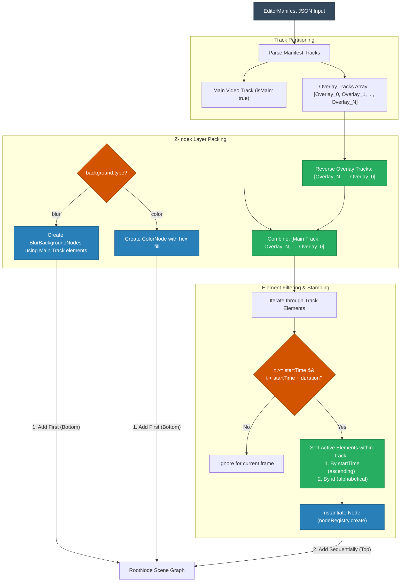

# Design Specification: Z-Index Layering and Track Sorting Logic

This specification details the track sorting, element prioritization, and Z-index layering logic implemented to construct a predictable Scene Graph from an `EditorManifest`.

---

## 🎨 1. Layer Hierarchy (Bottom to Top)

To compose the final frame correctly, layers must be rendered in order from the background up to the foreground. This translates directly to the order in which nodes are added to the `RootNode` scene graph (nodes added earlier are drawn first/at the bottom):

```
+-------------------------------------------------------+  ▲
|  Layer 3: Overlays (Text / Stickers / PIP Videos)      |  │ (Drawn Last - Topmost)
+-------------------------------------------------------+  │
|  Layer 2: Main Video (Main Track Clips)               |  │ Z-Index Order
+-------------------------------------------------------+  │
|  Layer 1: Background Backdrop (Blur Video / Color)    |  │ (Drawn First - Bottommost)
+-------------------------------------------------------+  ▼
```

### 1.1 Layer 1: Background Backdrop (Z-Index: 0)
The background is always rendered first to provide a solid canvas:
* **Color Background**: If the manifest configures a background color (e.g., `#000000`), a single `ColorNode` is added first.
* **Blurred Background**: If a blurred background is requested (`background.type === "blur"`), the compositor processes the **Main Video Track** elements. For each active video element, it creates a `BlurBackgroundNode` that stretches and blurs the corresponding frame. These blur backdrops are added at the very beginning of the node array.

### 1.2 Layer 2: Main Video Track (Z-Index: 1)
* Represents the core narrative track of the timeline, defined under `tracks.main`.
* Elements on this track are rendered directly over the background backdrop.

### 1.3 Layer 3: Overlay Tracks (Z-Index: 2+)
* Contains additional tracks such as overlay pictures, PiP (Picture-in-Picture) videos, nhãn dán (stickers), and subtitles/texts.
* **Stacking Order between Overlays**:
  - In the manifest, overlays are specified in an array `tracks.overlay = [Overlay_0, Overlay_1, ..., Overlay_N]`.
  - To ensure that the first overlay (`Overlay_0`) appears on top of the subsequent overlays, the tracks are processed in **reverse order**:
    $$\text{Stack Order: } \text{MainTrack} \longrightarrow \text{Overlay}_N \longrightarrow \text{Overlay}_{N-1} \longrightarrow \dots \longrightarrow \text{Overlay}_0$$
  - Point to note: `Overlay_0` (typically the subtitle or caption track) is added last to the scene graph and drawn on the very top.

### 1.4 Multiple Video Tracks Handling (Xử lý khi có nhiều Video Track)
Khi có nhiều Video Track trong timeline:
* **Chỉ duy nhất một Video Track** nằm trong `tracks.main` đóng vai trò là track nền chính (nằm ở dưới cùng - Z-Index: 1).
* **Tất cả các Video Track còn lại** nằm trong danh sách `tracks.overlay` sẽ tự động được xem là các **Overlay Video Tracks** (ví dụ: video Picture-in-Picture - PiP, các clip phụ họa, v.v.).
* Các Overlay Video Tracks này được sắp xếp và vẽ chèn đè lên trên Main Video Track theo đúng thứ tự đảo ngược của mảng overlay (`overlayTracks.reverse()`), nằm xen kẽ với các track phụ đề hay sticker tùy thuộc vào thứ tự chỉ mục của chúng trong mảng.

---

## 📝 2. Detailed Specifications: Tracks & Elements

### 2.1 Track Types
The schema supports 4 types of timeline tracks, each with specific roles and Z-Index constraints:

1. **Video Track (`type: "video"`)**
   - **Allowed Elements**: `video`, `image`, `transition`.
   - **Main Track**: Placed under `tracks.main`, positions video clips as the bottom-most layer. Renders at Z-Index: 1.
   - **Overlay Track**: Placed under `tracks.overlay`, places secondary picture-in-picture videos or images over the main video. Renders at Z-Index: 2+.
2. **Text Track (`type: "text"`)**
   - **Allowed Elements**: `text`.
   - **Position**: Always positioned as an Overlay Track at the top Z-Index layer (above videos and stickers) to prevent captions from being covered.
3. **Sticker Track (`type: "sticker"`)**
   - **Allowed Elements**: `sticker`.
   - **Position**: Positioned as an Overlay Track, typically layered between videos and text subtitles.
4. **Audio Track (`type: "audio"`)**
   - **Allowed Elements**: `audio`.
   - **Position**: **N/A (No visual position)**. Filtered out from the graphic rendering scene graph. Routed directly to the FFmpeg mixing graph.

---

### 2.2 Comprehensive Layout & Positioning Cases

The renderer processes 6 distinct layout cases to position visual components on the canvas:

#### Case 1: Static Absolute Layout (Tọa độ tuyệt đối tĩnh)
- **Concept**: The element is drawn at a fixed position and size. Coordinates `(x, y)` represent the top-left corner of the element relative to the canvas top-left origin `(0, 0)`.
- **Math**:
  $$centerX = x + \frac{width}{2}$$
  $$centerY = y + \frac{height}{2}$$
- **JSON Example**:
  ```json
  {
    "id": "static-watermark",
    "type": "image",
    "startTime": 0,
    "duration": 10,
    "sourceUrl": "http://example.com/logo.png",
    "width": 200,
    "height": 100,
    "x": 50,
    "y": 50,
    "opacity": 0.8
  }
  ```

---

#### Case 2: Keyframe Animation Layout (Nội suy chuyển động động)
- **Concept**: Tọa độ `x, y`, kích thước `width, height`, và độ mờ `opacity` thay đổi theo thời gian thông qua danh sách các mốc khóa (keyframes). Hệ thống sử dụng nội suy tuyến tính (LERP) để tính toán giá trị chính xác tại thời điểm $t_{\text{local}}$.
- **Math**:
  $$V = V_1 + \frac{t_{\text{local}} - T_1}{T_2 - T_1} \times (V_2 - V_1)$$
- **JSON Example (Zoom & Fade-in Video)**:
  ```json
  {
    "id": "animated-video",
    "type": "video",
    "startTime": 0,
    "duration": 5,
    "sourceUrl": "http://example.com/video.mp4",
    "width": 1280,
    "height": 720,
    "x": 0,
    "y": 0,
    "animations": {
      "opacity": [
        { "time": 0, "value": 0 },
        { "time": 1.5, "value": 1 }
      ],
      "width": [
        { "time": 0, "value": 1280 },
        { "time": 5, "value": 1920 }
      ],
      "height": [
        { "time": 0, "value": 720 },
        { "time": 5, "value": 1080 }
      ],
      "x": [
        { "time": 0, "value": 0 },
        { "time": 5, "value": -320 }
      ],
      "y": [
        { "time": 0, "value": 0 },
        { "time": 5, "value": -180 }
      ]
    }
  }
  ```

---

#### Case 3: Aspect Ratio Fit vs. Cover Scaling (Co giãn ảnh/video)
- **Concept**: Lắp đầy khung hình Canvas khi tỷ lệ khung hình của Video/Ảnh gốc không trùng khớp với cấu hình Canvas.
  - **Fit (Letterbox)**: Giữ nguyên tỷ lệ ảnh gốc, thêm viền đen hai bên/trên dưới.
  - **Cover (Crop & Fill)**: Phóng to tối đa để che phủ toàn bộ Canvas (thường dùng làm hình nền mờ).
- **Math (Cover Scale)**:
  $$\text{scale} = \max\left(\frac{\text{canvasWidth}}{\text{sourceWidth}}, \frac{\text{canvasHeight}}{\text{sourceHeight}}\right)$$
  $$\text{targetWidth} = \text{sourceWidth} \times \text{scale}$$
  $$\text{targetHeight} = \text{sourceHeight} \times \text{scale}$$
- **JSON Example (Background Blur Cover)**:
  ```json
  {
    "id": "background-video-cover",
    "type": "video",
    "startTime": 0,
    "duration": 10,
    "sourceUrl": "http://example.com/portrait.mp4",
    "width": 1080,
    "height": 1920,
    "x": 0,
    "y": 0,
    "blurIntensity": 25
  }
  ```

---

#### Case 4: Mirroring & Flip Layouts (Lật gương / Đảo ngược hình ảnh)
- **Concept**: Thực hiện lật ngang (`flipX: true`) hoặc lật dọc (`flipY: true`) khung ảnh bằng ma trận tỷ lệ âm.
- **Math**:
  `ctx.scale(flipX ? -1 : 1, flipY ? -1 : 1)` tại vị trí gốc tọa độ được dời về tâm `(centerX, centerY)`.
- **JSON Example**:
  ```json
  {
    "id": "flipped-sticker",
    "type": "sticker",
    "startTime": 2,
    "duration": 4,
    "stickerId": "emoji_cool",
    "width": 300,
    "height": 300,
    "x": 500,
    "y": 200,
    "flipX": true,
    "flipY": false
  }
  ```

---

#### Case 5: Text Alignment Layout (Canh lề & Cân chỉnh chữ viết)
- **Concept**: Text được vẽ trực tiếp trên canvas ảo cỡ 100% Canvas chính. Điểm vẽ chữ `(x, y)` được diễn giải theo chế độ `textAlign`:
  - `"center"`: Tọa độ X là trung điểm chiều ngang của dòng chữ.
  - `"left"` / `"start"`: Dòng chữ bắt đầu từ tọa độ X kéo sang phải.
  - `"right"` / `"end"`: Dòng chữ kết thúc tại tọa độ X kéo sang trái.
- **JSON Example (Karaoke Center Text)**:
  ```json
  {
    "id": "subtitle-karaoke",
    "type": "text",
    "startTime": 1,
    "duration": 3,
    "text": "Lấy anh đi, anh hứa lo cho em!",
    "style": {
      "fontSize": 56,
      "color": "#FFD700",
      "fontFamily": "Roboto",
      "x": 960,
      "y": 800,
      "textAlign": "center",
      "strokeColor": "#000000",
      "strokeWidth": 6
    }
  }
  ```

---

#### Case 6: Masking & Feathering Crop Layout (Định dạng Mặt nạ cắt)
- **Concept**: Sử dụng một bức ảnh mặt nạ (được khai báo bởi `mask.textureId`) để giới hạn vùng hiển thị của layer.
  - **Inverted**: Nếu là `true`, phần có pixel của mặt nạ sẽ bị đục lỗ (trong suốt), ngược lại thì giữ nguyên.
  - **Feather**: Làm mịn mờ đường viền cắt của mặt nạ.
- **JSON Example**:
  ```json
  {
    "id": "masked-image",
    "type": "image",
    "startTime": 0,
    "duration": 10,
    "sourceUrl": "http://example.com/avatar.jpg",
    "width": 400,
    "height": 400,
    "x": 100,
    "y": 100,
    "mask": {
      "textureId": "circle-mask-asset",
      "feather": 15,
      "inverted": false
    }
  }
  ```

---

## 🔄 3. Stacking & Processing Flowchart

This diagram illustrates how a raw manifest payload is parsed, sorted, and built into the drawing queue:



---

## 💻 4. Stacking Reference Implementation

The layering logic is implemented in the `buildSceneGraph` method of [canvas-renderer.ts](../src/core/renderer/canvas-renderer.ts):

```typescript
private buildSceneGraph(manifest: EditorManifest): void {
  const duration = this.calculateDuration(manifest);
  this.rootNode = new RootNode({ duration });

  // 1. Partition tracks: Find the main video track and group overlay tracks (ignoring audio tracks)
  const mainTrack = manifest.tracks.find(
    (t) => t.type === "video" && (t as any).isMain && !(t as any).hidden
  );
  const overlayTracks = manifest.tracks.filter(
    (t) => t.type !== "audio" && !(t as any).hidden && !(t.type === "video" && (t as any).isMain)
  );

  // 2. First Pass: Add all BlurBackgroundNode instances from the main track first (absolute bottom layer)
  if (mainTrack) {
    const sortedMainElements = [...mainTrack.elements].sort((a, b) => {
      if (a.startTime !== b.startTime) return a.startTime - b.startTime;
      return a.id.localeCompare(b.id);
    });

    for (const el of sortedMainElements) {
      if ((el.type === "video" || el.type === "image") && (el as any).blurIntensity !== undefined) {
        this.rootNode.add(
          new BlurBackgroundNode(
            el as any,
            this.videoSinksMap,
            this.imagesMap,
            this.width,
            this.height
          )
        );
      }
    }
  }

  // 3. Sort tracks from bottom to top: main track first, then overlays in reverse order
  const orderedTracks = [
    ...(mainTrack ? [mainTrack] : []),
    ...[...overlayTracks].reverse(),
  ];

  // 4. Second Pass: Add all primary visual elements
  for (const track of orderedTracks) {
    // Sort elements within the track by startTime, then alphabetically by ID to keep rendering deterministic
    const sortedElements = [...track.elements].sort((a, b) => {
      if (a.startTime !== b.startTime) return a.startTime - b.startTime;
      return a.id.localeCompare(b.id);
    });

    for (const el of sortedElements) {
      // Resolve the node from the Node Registry dynamically and add it to the scene graph
      const node = nodeRegistry.create(el.type, el, this);
      if (node) {
        this.rootNode.add(node);
      }
    }
  }
}
```


